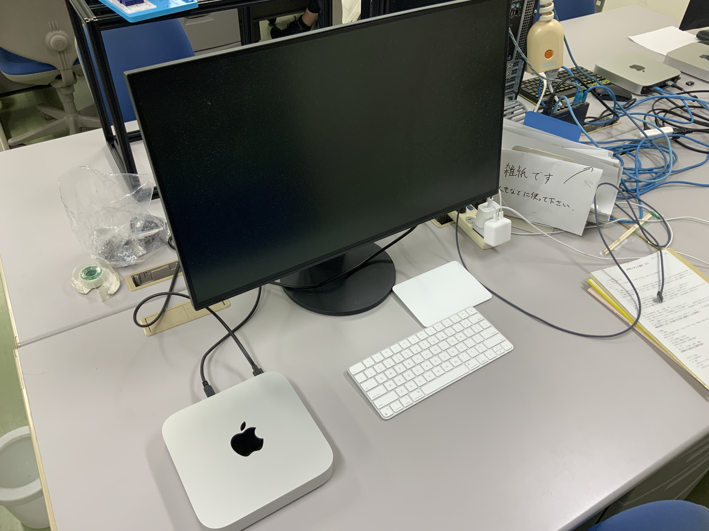

 ☕️ 研究紹介（click）

### 🐋 水環境工学研究室

私は，渡辺先生と同じ水環境工学研究室に所属しています．

簡単に言えば，私の方は，
***「自分でプログラム作成し，浮体動揺・魚遊泳法・津波など，波と物体の相互作用全般の数値解析を行う」***
方で，下のメンバーと一緒に研究をしています．

* 4年生：5名
* 修士1年生：1名

### ✍️ 指導方針や研究環境

* 研究室には，５，６台MacのPCがありますが，今は4年生が使っているので，3年生の間は各自のPCを使ってもらおうと思います
* 4年生は就職活動が終わるまでは忙しいと思うので，研究はゆっくり進めてもらいます
* 基本的に研究場所は自由です（研究を自律して進められない人には，研究室に来てもらいますが）
* 研究の質問はいつでも来て下さい
* 創造工房実習は，4年生が行っている研究に沿った内容を行います（基本的に，水理学，CADの使い方，プログラムの書き方回し方，数値解析の基礎について学んでもらいます）
* プログラムや数式が苦手な人も多いと思いますが，気にしなくていいです．私も最初は全く分かりませんでした
* 卒論指導はしていますが，生活指導などは特にしません．（学生とは対等な立場でありたいと思っています）

<!-- 

私の場合

- 必ず少なくとも週１回は指導教員に質問などしていました
- 自宅が遠かったこともあり，よく研究室に泊まっていました
- 学部４年生の時にMacを購入しました

 -->

### 📚 研究テーマ

自分のやりたいことがある学生には，それに沿った研究をしてもらっています．

それ以外の学生は，以下のようなテーマを中心に研究を進めています．

- 境界要素法（BEM-MEL）に関連する研究（[Longuet-Higgins](https://en.wikipedia.org/wiki/Michael_S._Longuet-Higgins)が発案した方法です）
- 境界要素法（BEM-MEL）を使ったバージ型浮体の動揺解析，係留索の解析
- 陽解法型SPH（EISPH）の関連する研究
- 水棲動物の遊泳効率に関する研究（[Lighthill](https://en.wikipedia.org/wiki/James_Lighthill)も関心があった面白い内容ですが，今は学生任せになっています）
    * 実際に魚のように動くロボットを作成して，その遊泳効率を実験で調べようとしています
    * 魚の学校🐟🐠🐡を数値シミュレーションも行っています

### 👩‍💻 数値解析を中心とした研究の魅力

興味のある現象を理解し上手に説明することを研究目的とする人が多いと思います．
私もそうです．細かく言えば，数値解析を通して，その現象を理解することが私は好きです．
自分が設定した条件下で，その現象を完璧に再現できれば，その現象をある程度は理解できたと考えるからです．

**数値解析手法**は，数学とプログラミングを組み合わせ，以下の様な問題を解くものです．
既に多くの手法が開発されています．この問題はあらゆる分野で見られるため，数値解析はとても有用です，
ゲームに限らず単純なアプリにも数値解析手法が使われていますし，
今これを見るために使っているPCやスマホの中にも，数値解析手法が組み込まれています．

<table style="border-collapse:collapse;border:2;cellspacing:5;cellpadding:5;">
<tr>
<td><a href="https://github.com/tomoakihirakawa/cpp/blob/main/builds/build_interpolation/README.md">関数近似/補間</a></td>
<td>←関数の微分</td>
<td><a href="https://github.com/tomoakihirakawa/cpp/blob/main/builds/build_integration/README.md">関数の積分</a></td>
<td><a href="https://github.com/tomoakihirakawa/cpp/blob/main/builds/build_root_finding/README.md">方程式の根を求める</a></td>
<td><a href="https://github.com/tomoakihirakawa/cpp/blob/main/builds/build_eigen_value/README.md">固有値問題の解法</a></td>
</tr>

<tr>
<td><a href="https://github.com/tomoakihirakawa/cpp/blob/main/builds/build_system_of_linear_eqs/README.md">線形方程式の解法</a>
<td><a href="https://github.com/tomoakihirakawa/cpp/blob/main/builds/build_ODE/README.md">常微分方程式の解法</a></td>
<td>偏微分方程式の解法</td>
<td><a href="https://github.com/tomoakihirakawa/cpp/blob/main/builds/build_Network/README.md">幾何学（格子生成/データ構造）</a>
</td>
</tr>
</table>

この数値解析手法を組み合わせ，物理現象を表す方程式を数値的に解くことで，現象をシミュレートすることができます．

<!-- #### 有用で普遍的な知識が身につけざるを得ない -->

十分に理解しないまま作成したプログラムで得られる結果は，実際の現象と大きく異なることが多いです．
適当でも結果が得られることもありますが，いろいろと試すうちにおかしいことに気づくことが多いです．
そのため，力学・数学・プログラミングの正確な理解がこの研究を行う上で重要です．
反対に言えば，この研究を通して，力学・数学・プログラミングを正確に学んでいくことができます．
辛くもありますが，この研究を通して，有用で普遍的な知識を身につけるきっかけが得られると思います．
これがこの研究の魅力です．

できるかはわかりませんが．．．．．

***もし，こんなシミュレーション・数値計算がしたいというものがあれば，一緒に研究してみませんか？***

<!-- ## ✉️ 連絡先

- 📧 Email: hirakawa`at`gipc.akita-u.ac.jp
- 🌐 Website: [秋田大学研究者総覧](https://akitauinfo.akita-u.ac.jp/html/100000862_ja.html?k=%E5%B9%B3%E5%B7%9D), [researchmap](https://researchmap.jp/tomoakihirakawa) -->

---

👤 自己紹介（click）

### 👤 自己紹介

- 💻 海洋の波や流れのシミュレーションに興味があり研究を始めました
- 🛠️ 大学院のときはスペクトル法というものを学んでいましたが，現在は**境界要素法**と**粒子法**を用いたソフトウェア開発を行っています

理論にも興味はありますが，何よりもまず現実の現象をシミュレートできるソフトを作りたいと思っています．

### 🚢 研究と開発

主に[浮体式洋上風力発電](https://en.wikipedia.org/wiki/Floating_wind_turbine)に関する研究を行っています．
浮体の動揺や係留索に関連する数値シミュレーションの需要は，今後増えていくと考えられます（最後に関連するリンクを貼っています）．

現在すでに[OrcaFlex](https://www.orcina.com/)や[WAMIT](https://www.wamit.com/)といった商用ソフトウェアがありますが，
現在の目標は，多くの浮体を含めウィンドファーム全領域をシミュレートできる
計算手法を提案することと，実用的なソフトウェアを開発することです．

* 境界要素法を使った浮体動揺解析ソフト
<table style="border-collapse:collapse;border:2;cellspacing:5;cellpadding:5;">
<tr>
<td>説明</td>
<td>境界要素法は，流体の運動方程式を流体境界上で解く手法です</td>
</tr>
<tr>
<td>使用言語</td>
<td>
<a href="https://en.wikipedia.org/wiki/C%2B%2B">C++</a>，
<a href="https://www.python.org/">python</a>
</td>
</tr>
<tr>
<td>リンク</td>
<td>
<a href="https://github.com/tomoakihirakawa/cpp/blob/main/builds/build_bem/README.md">build_bem</a>
</tr>
</table>

<table style="border-collapse:collapse;border:2;cellspacing:5;cellpadding:5;">
<tr>
<td>

</td>
<td>

</td>
</tr>
</table>

* 粒子法を使った流体物体相互作用解析ソフト

<table style="border-collapse:collapse;border:2;cellspacing:5;cellpadding:5;">
<tr>
<td>説明</td>
<td>
粒子法は，粒子の集まりで流体を表現し，流体の運動方程式を解く手法です．

要素を使う方法は，節点同士が適切に繋がって要素を成している必要があります．絡まるように不自然な繋がり方をしていると計算は失敗します．
一方，粒子法には，要素という概念がなく，節点の繋がり方を気にする必要があません．
そのため，粒子法は，砕波のような複雑な流れをシミュレートするのに適しています．
</td>
</tr>
<tr>
<td>使用言語</td>
<td>
<a href="https://en.wikipedia.org/wiki/C%2B%2B">C++</a>，
<a href="https://www.python.org/">python</a>
</td>
</tr>
<tr>
<td>リンク</td>
<td>
<a href="https://github.com/tomoakihirakawa/cpp/blob/main/builds/build_sph/README.md">build_sph</a>
</td>
</tr>
</table>

---

 
🌏世界の浮体式洋上風力発電のプロジェクト一覧🍃（click）

|プロジェクト詳細🌟|リンク🔗|備考📝|
|:----------------|:-------|:-----|
|🇯🇵 **国土交通省のサイト**|[浮体式洋上風力発電施設の普及促進について](https://www.mlit.go.jp/maritime/maritime_fr6_000006.html)|人気がないので追加|
|🇯🇵 **秋田県南部沖**で実証事業の候補地に選定！| [YouTube](https://www.youtube.com/watch?v=b8zqJr4L4MI), [NHK](https://www3.nhk.or.jp/lnews/akita/20231003/6010019188.html)|日本国内での取り組み|
|🏴󠁧󠁢󠁳󠁣󠁴󠁿 **スコットランドのグリーンエネルギー**が日本に進出| [YouTube](https://www.youtube.com/watch?v=oPx5OxBef0A)|外国の取り組み．１GWはおよそ原発１機分の出力です|
|🇳🇴 **Hywind Tampen**は世界最大の浮体式洋上ウィンドファーム| [Equinor](https://www.equinor.com/energy/hywind-tampen)|Equinorは以前「Statoil」という石油関連企業でしたが，2018年脱酸素に向け社名を変更しました|
|🇯🇵 **戸田建設**、五島福江島にウィンドファーム建設予定| [Toda Corp](https://www.toda.co.jp/business/ecology/special/)|国内企業によるプロジェクト|
|🇫🇷 **BW Ideol**は浮体動揺を抑制するダンピングプールの特許を持っています| [BW Ideol](https://bw-ideol.com/en)|革新的なフランス企業．日立造船や大成建設と覚書などを締結してます|
|🇯🇵 **NEDO委託**でバージ型浮体の研究開発が進行| [NEDO](https://www.nedo.go.jp/floating/project.html)|多くの日本企業と研究機関が参加しています|
|🇺🇸 **NREL**（米国再生可能エネルギー研究所）は，アメリカエネルギー省の研究機関| [NREL](https://www.nrel.gov/wind/offshore-wind.html),[OpenFAST](https://github.com/OpenFAST)|アメリカにおける研究活動|
|🌍 **多数の企業**が低コスト化を目標に研究開発進行中| [J-Power](https://www.jpower.co.jp/news_release/2023/05/news230530.html)|目標はどこも共通して，低コスト化です|

